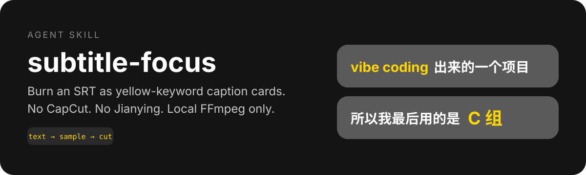
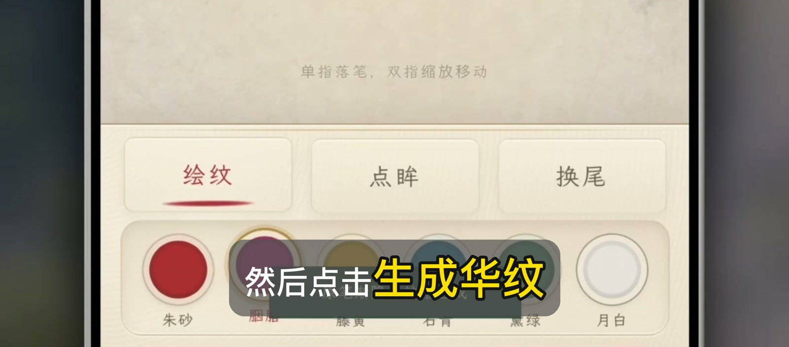
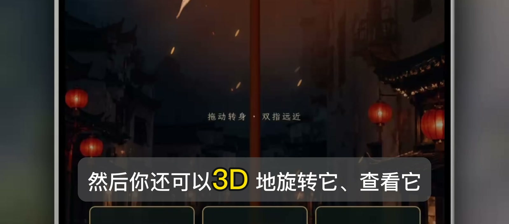
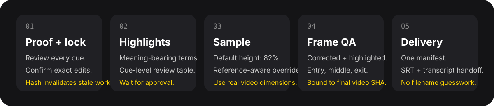

<p align="right">
  <strong>English</strong> · <a href="./README.zh-CN.md">简体中文</a>
</p>

<p align="center">
  
</p>

<p align="center">
  <a href="./LICENSE"></a>
  <a href="https://www.python.org/"></a>
  <a href="https://ffmpeg.org/"></a>
  
</p>

**subtitle-focus** is an Agent Skill plus a deterministic Python renderer. It reviews a timestamped SRT with layered glossaries, locks confirmed text, highlights meaning-bearing words, burns caption cards locally, extracts evidence from the final video, and registers one canonical delivery.

It deliberately starts from an exported SRT. It does not transcribe video, call Video Use, run local ASR/OCR, or infer timestamps from a plain MD transcript.

## Real output

These are cropped frames from a real 2160×3850 fish-lantern production. The screenshots are taken from the final rendered video; only the caption area is cropped.

<p align="center">
  
</p>

<p align="center">
  
</p>

<p align="center">
  
</p>

The renderer keeps Chinese and Latin on one baseline, enlarges only highlighted runs, and draws each run as a whole string so outlines do not collide.

## Why the workflow locks text first

A one-word correction can invalidate every derived artifact. In the production above, both cue 2 and cue 35 needed the exact term **生成华纹**. The current workflow stores the SRT SHA-256 in the lock and caption plan; any byte change makes stale plans, samples, renders, and deliveries fail closed.

<p align="center">
  
</p>

## Five gates

<p align="center">
  
</p>

1. **Proof + lock** — review every cue, apply only confirmed exact-text corrections, then lock the SRT by hash.
2. **Highlights** — choose meaning-bearing terms, keep every adjacent pair from going completely plain, and cap each sentence's highlights at 30%.
3. **Sample** — keep the default vertical position at 82%, or derive a versioned override from a supplied reference screenshot.
4. **Frame QA** — extract every corrected cue, every highlighted segment, and entry/middle/exit frames from the already-burned final video.
5. **Delivery** — write one manifest with video, SRT, plan, style, correction, review, and handoff hashes.

The Skill stops for human approval after text corrections, highlight selection, and the short sample.

Highlight continuity is deterministic: at most one rendered caption segment may remain plain in a row. Every adjacent pair therefore contains a visual focus. Highlighting every sentence is acceptable, but the combined highlighted ranges inside any one sentence may not exceed 30% of its non-whitespace visible characters. Short sentences can remain plain; the adjacent longer sentence should carry the focus instead of painting the short sentence almost entirely yellow. The review report shows per-sentence coverage and plain runs, while validation and rendering fail closed on violations.

## Layered glossaries

The base glossary loads automatically. Add the bundled AI pack with `--domain ai`, keep reusable personal terms in `~/.config/subtitle-focus/glossary.json`, and pass a project glossary for the current production. Personal and project glossaries are not requested during installation.

```text
project > legacy custom > personal > domain > base
```

Glossaries contain known-wrong forms and canonical suggestions. They never rewrite SRT text automatically. A project entry overrides lower layers only when it targets the same exact wrong form, and every review row records its source.

Before Gate 1, the user must explicitly choose to use or skip both the personal and project glossary layers. This records the decision without forcing either file to exist. The review shows logical layer names and hashes, not glossary absolute paths or user-defined names.

The project deliberately has no general capitalization, number/unit, pronoun, punctuation, or CJK/Latin spacing engine. Add only real, enumerated corrections requested by users. Existing mixed-script segmentation and baseline rendering remain unchanged.

```bash
python3 skill/scripts/subtitle_focus.py glossary-init --scope personal
python3 skill/scripts/subtitle_focus.py glossary-init \
  --scope project --output /abs/project-glossary.json
```

## Install

```bash
git clone https://github.com/manwithshit/subtitle-focus.git
cd subtitle-focus

# Codex / compatible agent runtimes
ln -s "$(pwd)/skill" ~/.agents/skills/subtitle-focus

# Claude Code
ln -s "$(pwd)/skill" ~/.claude/skills/subtitle-focus
```

The symlink name must match the `name` in [skill/SKILL.md](./skill/SKILL.md).

Packaged artifact: [dist/subtitle-focus.skill](./dist/subtitle-focus.skill).

### Requirements

- Python 3.9+
- Pillow with FreeType
- `ffmpeg` and `ffprobe` with the `overlay` filter

```bash
python3 skill/scripts/subtitle_focus.py doctor
```

## First successful run

```bash
SCRIPT=skill/scripts/subtitle_focus.py
WORK=/abs/work

python3 "$SCRIPT" proofread \
  --srt /abs/input.srt \
  --domain ai \
  --no-personal-glossary \
  --no-project-glossary \
  --output "$WORK/text-review.md"

# Draft corrections.json only after reviewing SRT context, glossary provenance,
# project evidence, and user corrections.
python3 "$SCRIPT" correct \
  --srt /abs/input.srt \
  --corrections "$WORK/corrections.json" \
  --output "$WORK/locked-text.srt" \
  --review "$WORK/corrections-review.md"

# Run only after the user confirms the correction table.
python3 "$SCRIPT" lock \
  --srt "$WORK/locked-text.srt" \
  --output "$WORK/srt-lock.json" \
  --confirmed

python3 "$SCRIPT" plan \
  --srt "$WORK/locked-text.srt" \
  --lock "$WORK/srt-lock.json" \
  --output "$WORK/caption-plan.json"

python3 "$SCRIPT" apply \
  --plan "$WORK/caption-plan.json" \
  --highlights "$WORK/highlight.json" \
  --output "$WORK/caption-plan.highlighted.json"

python3 "$SCRIPT" review \
  --plan "$WORK/caption-plan.highlighted.json" \
  --output "$WORK/highlight-review.md"

python3 "$SCRIPT" validate \
  --plan "$WORK/caption-plan.highlighted.json" \
  --video /abs/input.mp4
```

Show the correction and highlight tables to the user. Do not render before approval.

## Reference-demo layout

The bundled default remains `center_y_ratio: 0.82`. A supplied demo screenshot creates a project-specific, versioned style instead of changing that default.

```bash
python3 "$SCRIPT" style \
  --base skill/assets/default-style.json \
  --reference-image /abs/demo.png \
  --center-y-ratio 0.73 \
  --safe-width-ratio 0.76 \
  --font-size-max 88 \
  --output "$WORK/style-v1.json"

python3 "$SCRIPT" preview \
  --video /abs/input.mp4 \
  --plan "$WORK/caption-plan.highlighted.json" \
  --style "$WORK/style-v1.json" \
  --cue 2 \
  --output "$WORK/cue-2.png"
```

The style stores the reference image path, SHA-256, dimensions, base-style SHA, and explicit overrides.

## Render, review, deliver

```bash
python3 "$SCRIPT" render \
  --video /abs/input.mp4 \
  --plan "$WORK/caption-plan.highlighted.json" \
  --style "$WORK/style-v1.json" \
  --output "$WORK/final-subtitled.mp4"

python3 "$SCRIPT" frames \
  --video "$WORK/final-subtitled.mp4" \
  --already-burned \
  --plan "$WORK/caption-plan.highlighted.json" \
  --style "$WORK/style-v1.json" \
  --corrections "$WORK/corrections.json" \
  --output-dir "$WORK/review-frames"

python3 "$SCRIPT" deliver \
  --video "$WORK/final-subtitled.mp4" \
  --srt "$WORK/locked-text.srt" \
  --plan "$WORK/caption-plan.highlighted.json" \
  --style "$WORK/style-v1.json" \
  --corrections "$WORK/corrections.json" \
  --review-dir "$WORK/review-frames" \
  --output "$WORK/delivery.json"
```

`frames` produces full-resolution PNGs, `contact-sheet.jpg`, `index.md`, and `index.json`. `deliver` rejects corrected cues without frames and rejects review evidence from a different final-video SHA.

Optional handoff can copy the final SRT, generate a transcript, copy an existing publishing document, and copy the video only when `--copy-video` is explicit. Existing files are never overwritten.

## Commands

| Command | Job |
| --- | --- |
| `doctor` | Check Pillow, fonts, FFmpeg, FFprobe, and overlay support |
| `glossary-init` | Create an editable empty personal or project glossary |
| `proofread` | Build a cue-by-cue review from layered, sourced glossary suggestions |
| `correct` | Apply confirmed exact-text changes without changing timecodes |
| `lock` | Freeze the approved SRT by hash |
| `plan` | Segment a locked SRT |
| `apply` / `review` | Apply and review semantic highlights |
| `style` / `preview` | Derive and inspect a versioned layout |
| `render` | Burn the subtitle overlay |
| `frames` | Extract final-video correction and highlight evidence |
| `deliver` | Register the one authoritative delivery and optional handoff |

Schemas and visual rules:

- [SRT text lock](./skill/references/text-lock-schema.md)
- [Highlight plan](./skill/references/highlight-schema.md)
- [Reference-demo calibration](./skill/references/style-calibration.md)
- [Visual contract](./skill/references/visual-spec.md)
- [Delivery manifest](./skill/references/delivery-schema.md)

## Verify the repository

```bash
python3 -m unittest discover -s tests -v
python3 -m py_compile skill/scripts/subtitle_focus.py
python3 scripts/build_skill_package.py
```

The fifteen-test suite includes highlight cadence, all-sentence highlighting under the cap, short-sentence and per-sentence 30% rejection, explicit glossary choices, report path redaction, multiline/repeated-space preservation, layered-glossary precedence, plain-MD rejection, a real FFmpeg end-to-end render, stale-SRT rejection, reference-demo style provenance, corrected-cue frame coverage, final-video SHA binding, and handoff generation. The package builder includes tracked Skill files only and rejects conventional personal/project glossary filenames.

## Defaults and limits

| Token | Default |
| --- | --- |
| Font | System PingFang SC Medium |
| Body size | 4.8% of frame height |
| Caption center | 82% of frame height |
| Highlight | 1.34× body, `#FFD600`, dark outline |
| Highlight cadence | At most one consecutive plain caption segment |
| Highlight coverage | At most 30% per caption segment |
| Bubble | `#505050`, 69% opacity, 28% padding, 40% corner |

- Source SRT and video are never replaced.
- A timestamped SRT is required. Plain MD and video-only inputs stop before Gate 1.
- No Video Use, 剪口播, Whisper, ASR, or OCR is invoked.
- Personal and project glossary use must be explicitly selected or skipped at Gate 1.
- Local glossary filenames matching `personal-glossary.json`, `project-glossary.json`, or `*.private-glossary.json` are ignored by Git.
- Corrections preserve unmentioned SRT line breaks and repeated spaces; mixed-script layout is derived later without rewriting the lock.
- The renderer needs a CJK-capable font.
- Full-length 4K-class encodes take time; the sample gate exists to catch layout errors first.
- The repository ships no source footage. The README contains cropped final-output frames only.
- Audio mixing is intentionally outside this Skill.

## License

[MIT](./LICENSE)
