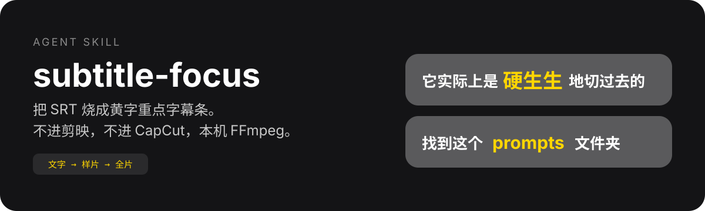
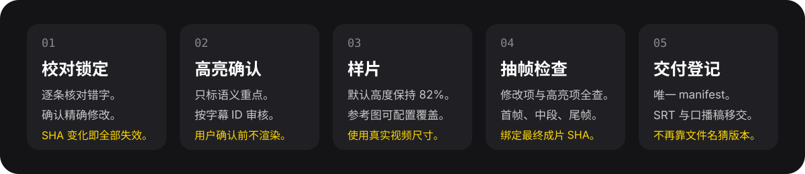

<p align="right">
  <a href="./README.md">English</a> · <strong>简体中文</strong>
</p>

<p align="center">
  
</p>

<p align="center">
  <a href="./LICENSE"></a>
  <a href="https://www.python.org/"></a>
  <a href="https://ffmpeg.org/"></a>
  
</p>

**subtitle-focus** 是一套 Agent Skill + 确定性 Python 渲染器。它先用分层词库校对带时间码的 SRT，再锁定文字、选择黄字重点、本机烧录字幕、从最终成片抽帧检查，最后登记唯一交付。

它明确从用户导出的 SRT 开始，不转写视频，不调用 Video Use，不运行本地 ASR/OCR，也不根据纯 MD 口播稿猜测时间码。

## 真实成片效果

下面来自一个真实的 2160×3850 徽州鱼灯成片。截图直接取自最终视频，只裁出字幕区域。

<p align="center">
  
</p>

<p align="center">
  
</p>

<p align="center">
  
</p>

中文和英文共用一条基线，只有重点词放大，整段文字一次绘制，不会因为逐字描边而产生重叠。

## 为什么先锁定文字

一个字改动，就可能让所有后续文件过期。上面的真实项目中，字幕 ID 2 和 ID 35 都必须使用项目术语 **生成华纹**。现在 SRT 锁和字幕计划会记录 SHA-256；只要 SRT 发生任何字节变化，旧计划、样片、成片和交付都会直接失效。

<p align="center">
  
</p>

## 五道确认闸

<p align="center">
  
</p>

1. **校对锁定**：逐条核对字幕，只执行用户确认的精确替换，然后按 SHA 锁定 SRT。
2. **高亮确认**：只选择真正承载意义的词，并输出按字幕 ID 审核的表格。
3. **样片**：没有参考图时保持默认高度 82%；收到参考截图时，生成项目独立的可配置样式。
4. **抽帧检查**：从已经烧录字幕的最终成片中，抽取所有修改字幕、所有高亮字幕和首中尾画面。
5. **交付登记**：用唯一 manifest 记录视频、SRT、计划、样式、修改、抽帧和 handoff 的路径与指纹。

文字修改、高亮选择和样片都必须经过用户确认，不能由 Agent 自己跳闸。

## 分层词库

基础词库默认加载；AI 场景使用 `--domain ai`；长期使用的个人词放在 `~/.config/subtitle-focus/glossary.json`；当前视频独有词汇通过项目词库传入。

```text
项目 > 旧版自定义 > 个人 > 场景 > 基础
```

词库保存“已知错误形式 → 标准写法”。它只生成带来源的纠正建议，绝不自动改写 SRT。同一个错误形式发生冲突时，项目词库覆盖低优先级词库。

```bash
python3 skill/scripts/subtitle_focus.py glossary-init --scope personal
python3 skill/scripts/subtitle_focus.py glossary-init \
  --scope project --output /abs/project-glossary.json
```

## 安装

```bash
git clone https://github.com/manwithshit/subtitle-focus.git
cd subtitle-focus

# Codex / 兼容的 Agent 运行时
ln -s "$(pwd)/skill" ~/.agents/skills/subtitle-focus

# Claude Code
ln -s "$(pwd)/skill" ~/.claude/skills/subtitle-focus
```

软链目录名必须与 [skill/SKILL.md](./skill/SKILL.md) 里的 `name` 一致。

打包文件：[dist/subtitle-focus.skill](./dist/subtitle-focus.skill)。

### 环境要求

- Python 3.9+
- 带 FreeType 的 Pillow
- 带 `overlay` 滤镜的 `ffmpeg` 与 `ffprobe`

```bash
python3 skill/scripts/subtitle_focus.py doctor
```

## 第一次跑通

```bash
SCRIPT=skill/scripts/subtitle_focus.py
WORK=/abs/work

python3 "$SCRIPT" proofread \
  --srt /abs/input.srt \
  --domain ai \
  --project-glossary /abs/project-glossary.json \
  --output "$WORK/text-review.md"

# 根据 SRT 前后文、词库来源、项目资料和用户纠正整理 corrections.json。
python3 "$SCRIPT" correct \
  --srt /abs/input.srt \
  --corrections "$WORK/corrections.json" \
  --output "$WORK/locked-text.srt" \
  --review "$WORK/corrections-review.md"

# 修改表经用户确认后才能执行。
python3 "$SCRIPT" lock \
  --srt "$WORK/locked-text.srt" \
  --output "$WORK/srt-lock.json" \
  --confirmed

python3 "$SCRIPT" plan \
  --srt "$WORK/locked-text.srt" \
  --lock "$WORK/srt-lock.json" \
  --output "$WORK/caption-plan.json"

python3 "$SCRIPT" apply \
  --plan "$WORK/caption-plan.json" \
  --highlights "$WORK/highlight.json" \
  --output "$WORK/caption-plan.highlighted.json"

python3 "$SCRIPT" validate \
  --plan "$WORK/caption-plan.highlighted.json" \
  --video /abs/input.mp4

python3 "$SCRIPT" review \
  --plan "$WORK/caption-plan.highlighted.json" \
  --output "$WORK/highlight-review.md"
```

把字幕修改表和高亮表交给用户确认。确认前不渲染。

## 参考图样式

默认值仍然是 `center_y_ratio: 0.82`。只有用户提交参考截图时，才为当前项目生成一个版本化样式，不改全局默认值。

```bash
python3 "$SCRIPT" style \
  --base skill/assets/default-style.json \
  --reference-image /abs/demo.png \
  --center-y-ratio 0.73 \
  --safe-width-ratio 0.76 \
  --font-size-max 88 \
  --output "$WORK/style-v1.json"

python3 "$SCRIPT" preview \
  --video /abs/input.mp4 \
  --plan "$WORK/caption-plan.highlighted.json" \
  --style "$WORK/style-v1.json" \
  --cue 2 \
  --output "$WORK/cue-2.png"
```

样式文件会保存参考图路径、SHA-256、尺寸、基础样式指纹和所有明确覆盖值。

## 烧录、抽帧、交付

```bash
python3 "$SCRIPT" render \
  --video /abs/input.mp4 \
  --plan "$WORK/caption-plan.highlighted.json" \
  --style "$WORK/style-v1.json" \
  --output "$WORK/final-subtitled.mp4"

python3 "$SCRIPT" frames \
  --video "$WORK/final-subtitled.mp4" \
  --already-burned \
  --plan "$WORK/caption-plan.highlighted.json" \
  --style "$WORK/style-v1.json" \
  --corrections "$WORK/corrections.json" \
  --output-dir "$WORK/review-frames"

python3 "$SCRIPT" deliver \
  --video "$WORK/final-subtitled.mp4" \
  --srt "$WORK/locked-text.srt" \
  --plan "$WORK/caption-plan.highlighted.json" \
  --style "$WORK/style-v1.json" \
  --corrections "$WORK/corrections.json" \
  --review-dir "$WORK/review-frames" \
  --output "$WORK/delivery.json"
```

`frames` 会生成全尺寸 PNG、`contact-sheet.jpg`、`index.md` 和 `index.json`。如果修改字幕缺少抽帧，或者抽帧不是来自同一个最终成片 SHA，`deliver` 会拒绝交付。

可选 handoff 能复制最终 SRT、生成口播稿、复制已有发布文案；只有显式传入 `--copy-video` 才复制视频。已有文件永不覆盖。

## 命令表

| 命令 | 作用 |
| --- | --- |
| `doctor` | 检查 Pillow、字体、FFmpeg、FFprobe 和 overlay |
| `glossary-init` | 创建可编辑的空白个人词库或项目词库 |
| `proofread` | 使用分层词库输出逐条、带来源的纠正建议 |
| `correct` | 只执行已确认的精确文字替换，不改时间轴 |
| `lock` | 用内容指纹锁定确认后的 SRT |
| `plan` | 把锁定 SRT 切成字幕段 |
| `apply` / `review` | 应用并审核语义高亮 |
| `style` / `preview` | 生成并检查版本化样式 |
| `render` | 烧录字幕 |
| `frames` | 从最终成片抽取修改与高亮证据 |
| `deliver` | 登记唯一交付和可选 handoff |

结构与规则：

- [SRT 文字锁](./skill/references/text-lock-schema.md)
- [高亮计划](./skill/references/highlight-schema.md)
- [参考图样式校准](./skill/references/style-calibration.md)
- [视觉绘制合同](./skill/references/visual-spec.md)
- [交付 manifest](./skill/references/delivery-schema.md)

## 验证仓库

```bash
python3 -m unittest discover -s tests -v
python3 -m py_compile skill/scripts/subtitle_focus.py
```

9 项测试覆盖分层词库优先级、纯 MD 拒绝、真实 FFmpeg 端到端烧录、旧 SRT 自动失效、参考图来源记录、修改字幕抽帧、最终成片 SHA 绑定和 handoff 生成。

## 默认值与边界

| 项 | 默认值 |
| --- | --- |
| 字体 | 系统苹方 SC Medium |
| 正文字号 | 画面高度的 4.8% |
| 字幕中心 | 画面高度的 82% |
| 高亮 | 正文 1.34 倍、`#FFD600`、深色描边 |
| 底条 | `#505050`、69% 不透明度、28% 边距、40% 圆角 |

- 原 SRT 和原视频永远不覆盖。
- 必须提供带时间码的 SRT；纯 MD 和只有视频的输入会在第一阶段前停止。
- 不调用 Video Use、剪口播、Whisper、ASR 或 OCR。
- 渲染需要能显示中文的字体。
- 接近 4K 的完整编码需要时间，先用样片抓布局错误。
- 仓库不包含源视频；README 只保留裁切后的最终效果截图。
- 音频混音明确不属于这个 Skill。

## 许可

[MIT](./LICENSE)
